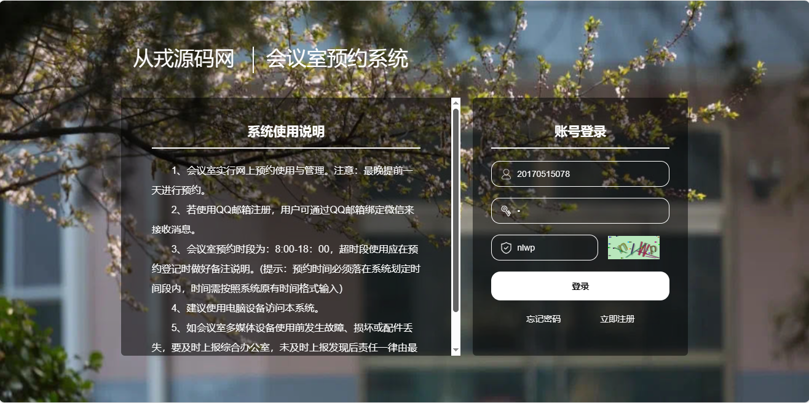
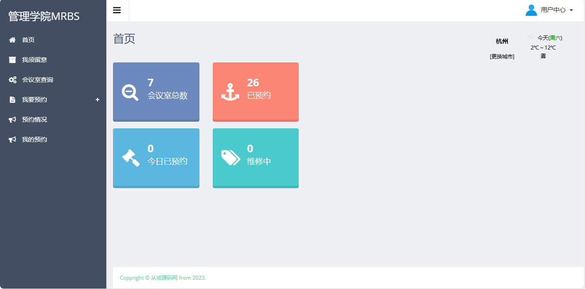
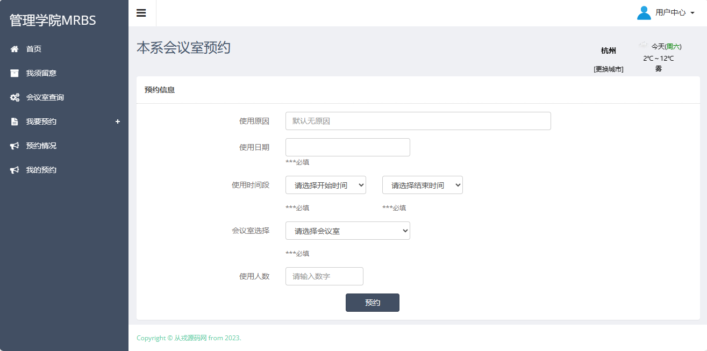
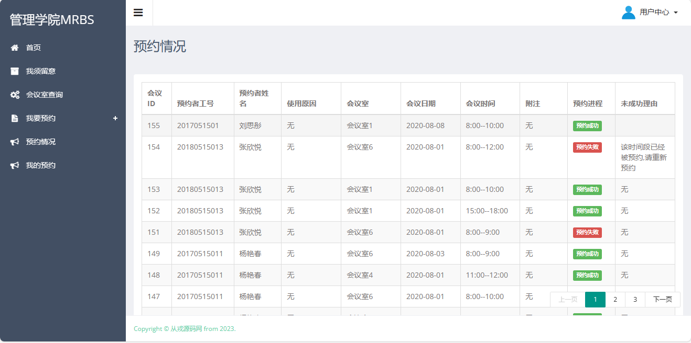
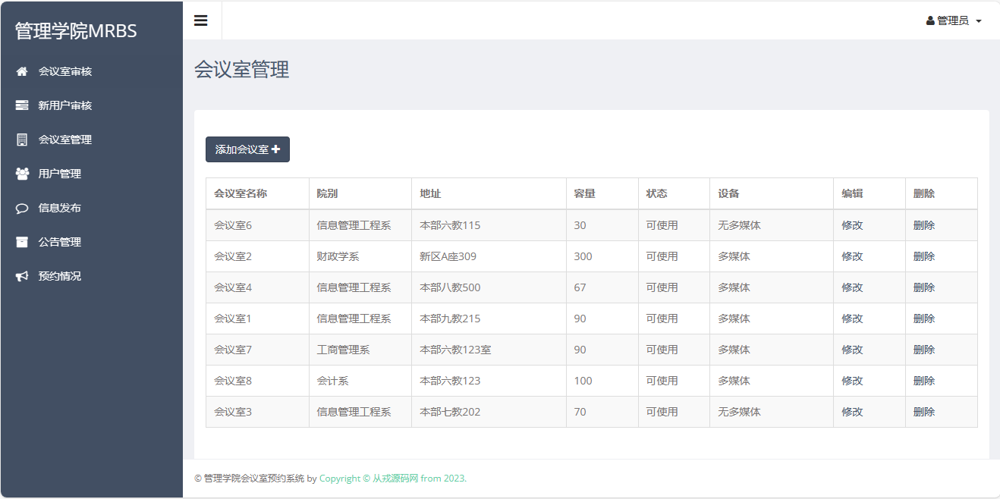
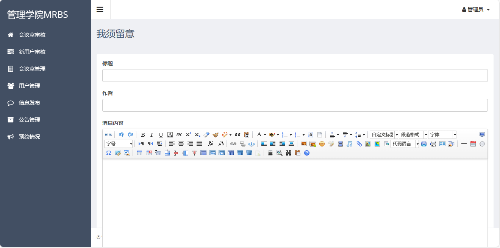

<h1 align="center">48.基于ssm的会议室预约管理系统</h1>

 获取sql文件 QQ: 386869957 QQ群: 377586148 

 [推荐站点: 从戎源码网](https://armycodes.com/) 

## 简介
> 本代码来源于网络,仅供学习参考使用!
> 
> 用户端登录地址：http://localhost:8080/front/frontlogin.html
> 
> 用户：20170515078 1
> 
> 管理端登录地址：http://localhost:8080/back/backlogin.html
> 
> 管理员：1 1
>

## 项目介绍
基于ssm的会议室预约管理系统：前端jquery、layui，后端 spring、mybatis，集成会议室查询、会议室预约、查看我的会议、查看当前会议室情况、查看管理条例等功能于一体的系统。

## 功能介绍

用户端：登录、会议室查询、会议室预约、管理我的预约、查看我的会议、查看当前会议室情况、查看通知公告、查看管理条例 等
管理员端：登录、会议室审核、邮件通知审核结果、会议室管理、用户管理、发布管理条例、发布通知公告、查看使用情况、查看数据统计 等

## 环境

- <b>IntelliJ IDEA 2009.3</b>

- <b>Mysql 5.7.26</b>

- <b>Tomcat 7.0.73</b>

- <b>JDK 1.8</b>

## 运行截图

